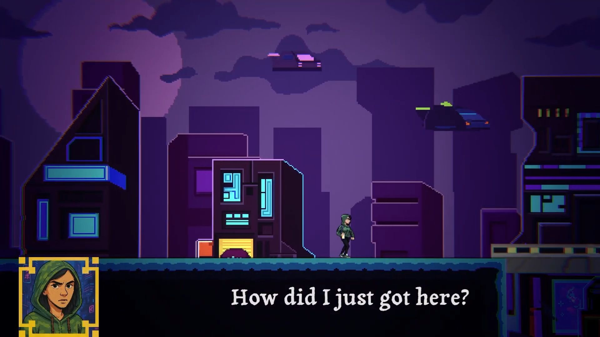

# Collapsed Universe

---

## Yapay Zeka ve Teknoloji Akademisi - Game Jam 2025 - Grup 26

### Tema
*Paralel Evrenler*

### Hikaye
Karakterimiz cyberpunk bir şehirde bir grafiti sanatçısı, bir gün polislerden kaçarken henüz açılmış olan bir portalın enerjisi karakterimizin epey başını ağrıtır. Polisten kaçmayı zorlaştırır hatta karakterimiz önünü bile göremez olur ve bir boşluktan aşağı düşer. Düştüğü boşlukta portal vardır, bu portal onu evi olan evreninden çıkmaya zorlayacaktır. Devamında da karakterimiz evrenine geri dönmenin yollarını arayacaktır.

### Grup 26 Üyeleri:
- Emir Beşir
- Furkan Beşirli
- Berke Bakırcı
- Rümeysa Sardohan
- Arzu Ekinli

### Ekran Görüntüleri

Bazı oyun içi ekran görüntüleri

*Cyberpunk evren*

---

*Steampunk evren*

---

### [Kullandığımız Assetler](./Assets/External/README.md)
