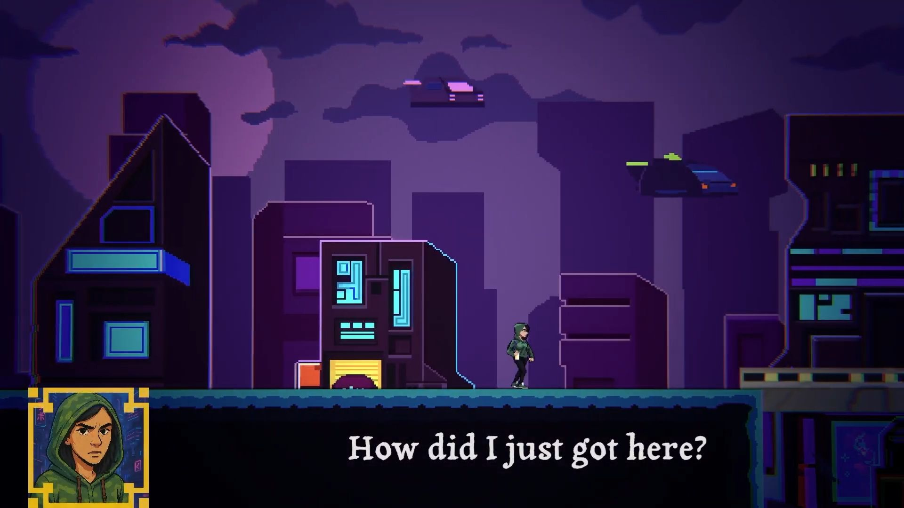
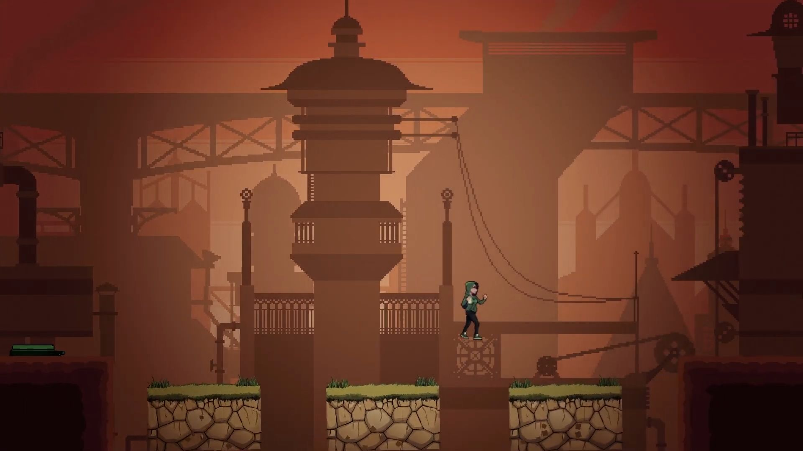

# Collapsed Universe - YZTA Game Jam 2025

Bu repository'de Yapay Zeka ve Teknoloji Akademisinin düzenlemiş olduğu Paralel Evrenler temalı Game Jam için C# ve Unity Oyun Motoruyla yapılmış bir 2D platformer oyunu bulunuyor.

_**Unity 6000.0.48f1** ile yapıldı ve test edildi_

## Takım Üyeleri

- Emir Beşir
- Furkan Beşirli
- Berke Bakırcı
- Rümeysa Sardohan
- Arzu Ekinli

## Assetler

[Kullanılan Assetler](Portal-Game/Assets/External/README.md)

## Ekran Görüntüleri

*Cyberpunk evren*

---

*Steampunk evren*

---
